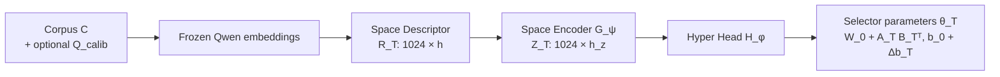

# Architecture

Source of truth for the system design. Rationale and full module specifications are in the
[implementation plan](plan/Qwen3_HyperDIME_Implementation_Plan.en.md); protocols and leakage rules
are in [protocols.md](protocols.md).

## Overview

Qwen3-Embedding-0.6B defines a fixed 1024-dimensional coordinate system. The system adapts *which*
coordinates a query uses to the retrieval environment it searches:

`T = (corpus C, query distribution Q, instruction I, frozen Qwen3-Embedding-0.6B)`

### Offline, once per environment

`θ_T` is persisted and reused for every query of the environment.

### Online, per query

`score(q, d) = (e'_q)ᵀ e_d`. Document embeddings are never modified.

## Components

| Component | Plan | Package | Implemented |
|---|---|---|---|
| Contracts, manifests, seeds | M0 | `hyperdime.contracts` | — |
| Loaders, splits, negatives | M1 | `hyperdime.data` | `splits.split_ids`, `negatives.mine_hard_negatives` |
| Frozen Qwen embeddings | M2 | `hyperdime.embeddings` | `qwen.format_query`, `qwen.last_token_pool` |
| Oracle targets `softmax(e_q ⊙ (p − n) / τ)` | M3 | `hyperdime.oracle` | `importance.oracle_scores`, `importance.oracle_importance` |
| Learning-to-Select and other baselines | M3 | `hyperdime.baselines` | `learning_to_select.LinearSelector` |
| Selector and meta-training | M3, M9 | `hyperdime.training` | `losses.selector_kl_loss` |
| Selector-shift analysis | M4 | `hyperdime.evaluation` | — |
| Space Descriptor and Space Encoder | M5, M6 | `hyperdime.space` | — |
| Low-rank selector and Hyper Head | M7, M8 | `hyperdime.hypernet` | — |
| Inference protocols P0–P2 | M10 | `hyperdime.cli`, `hyperdime.contracts` | — |
| Selection policies | M11 | `hyperdime.selection` | `topk.resolve_k`, `topk.top_k_mask`, `topk.apply_mask` |
| Retrieval | M12 | `hyperdime.retrieval` | `exact.exact_search` |
| Metrics and statistics | M12 | `hyperdime.evaluation` | `metrics.query_metrics`, `metrics.evaluate_run` |

File names inside each package follow plan §4.

## Invariants

- Embeddings have shape `(N, 1024)`, use last-token pooling, and are L2-normalized in the main
  protocol. Queries carry the instruction prefix `Instruct: {instruction}\nQuery:{query}`;
  documents are encoded without one.
- The same text, config, and model revision produce the same vector within numerical tolerance.
- Selection is query-only: `apply_mask` zeroes coordinates and does not re-normalize.
- `k = 1024` is equivalent to full-dimensional scoring; ratios resolve to `floor(ρ · 1024)`.
- With zero modulation, the generated selector equals the base selector `θ_0`.
- Descriptors are invariant to the order of sampled documents and queries, and are **not**
  invariant to dimension identity: permuting dimensions permutes descriptor rows.
- Importance prediction is separate from the policy that decides how many dimensions to keep.

## Design choices

- **Environment-conditioned, not query-conditioned.** Unlike Hypencoder, which builds a network per
  query from query tokens, the Hyper Head reads an environment descriptor and produces one selector
  per environment. The query-conditioned design was tried and did not beat the linear selector
  (ADR-0001).
- **Residual low-rank generation.** Generating a full `1024 × 1024` matrix per environment is
  intractable. The Hyper Head produces `A_T`, `B_T` (rank 4–32), and `Δb_T`, with a near-zero
  initialization so that training starts from the global selector.
- **Low capacity first.** The Space Encoder starts as a per-dimension MLP plus a dimension-ID
  embedding. Inter-dimension Transformer blocks, contrast and redundancy features, and adaptive k
  are added only when an ablation shows the simpler version is limiting.
- **Gates before complexity.** No hypernetwork code is written before Gate G2 (selector shift)
  passes. A failed gate is recorded as evidence in an ADR.

## Gates

| Gate | Claim | Decided by |
|---|---|---|
| G1 | The Learning-to-Select baseline converges, masking is correct, exact retrieval ranks as expected | E0 |
| G2 | Selector shift is functional across environments (H1) | M4 transfer matrix and behavior analysis |
| G3 | The environment descriptor predicts selector properties above baseline (H2) | M5 probes |
| G4 | The hypernetwork narrows the global vs per-domain gap on unseen environments (H3) | E3 |
| G5 | Offline adaptation is amortizable and online overhead keeps the dimension-reduction benefit | E6 |
