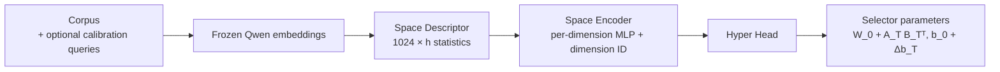
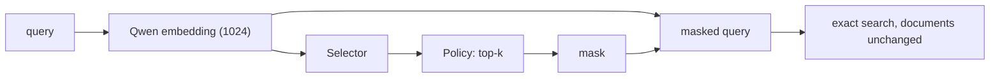

# Architecture

Canonical version: [docs/architecture.md](https://github.com/wilkertl/hyper-mask-net/blob/master/docs/architecture.md).

A retrieval environment is `T = (corpus, query distribution, instruction, frozen Qwen3-Embedding-0.6B)`.
Because the encoder never changes, the identity of the 1024 coordinates is stable across
environments, and what changes is how useful each coordinate is.

## Offline, once per environment

## Online, per query

## Components

| Component | Plan module | Package |
|---|---|---|
| Contracts and manifests | M0 | `hyperdime.contracts` |
| Data, splits, negatives | M1 | `hyperdime.data` |
| Frozen embeddings | M2 | `hyperdime.embeddings` |
| Oracle and baselines | M3 | `hyperdime.oracle`, `hyperdime.baselines` |
| Selector-shift analysis | M4 | `hyperdime.evaluation` |
| Space Descriptor and Encoder | M5, M6 | `hyperdime.space` |
| Low-rank selector and Hyper Head | M7, M8 | `hyperdime.hypernet` |
| Training | M3, M9 | `hyperdime.training` |
| Selection policies | M11 | `hyperdime.selection` |
| Retrieval and metrics | M12 | `hyperdime.retrieval`, `hyperdime.evaluation` |

## Why this design

- **Per environment, not per query.** A per-query hypernetwork built from query tokens was tried in
  the previous prototype and did not beat a linear selector.
- **Low-rank residual.** Generating a full 1024 × 1024 matrix is intractable; small deltas starting
  near zero keep the base selector intact at the start of training.
- **Simple first.** Inter-dimension Transformers, contrast and redundancy features, and adaptive k
  come only after ablations show they are needed.
