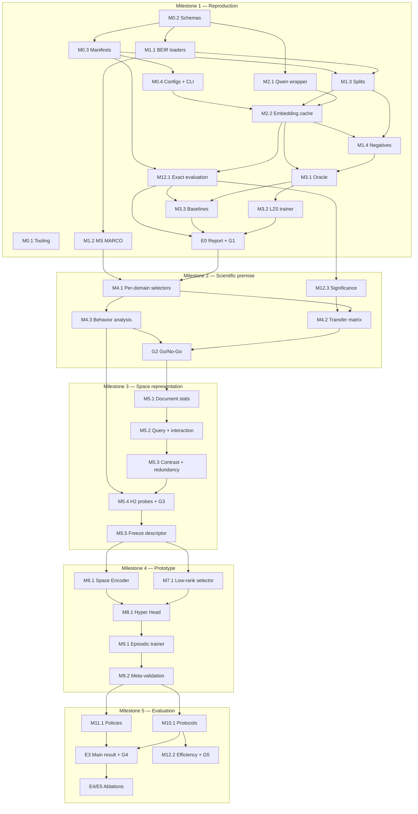

# Roadmap

Issues carry the ticket IDs below in their titles, e.g. `[M3.1] Oracle importance targets`.

## Milestones and phases

| Milestone | Phase | Tickets | Exit |
|---|---|---|---|
| **1 — Reproduction** | A Foundation | M0.1, M0.2, M0.3, M0.4, M1.1, M1.2, M1.3, M2.1, M2.2, M1.4 | — |
| | B Scientific baseline | M12.1, M3.1, M3.2, M3.3, E0 | Gate G1 |
| **2 — Scientific premise** | C Evidence for H1 | M12.3, M4.1, M4.2, M4.3, G2 | Gate G2 (Go/No-Go) |
| **3 — Space representation** | D Space representation | M5.1, M5.2, M5.3, M5.4, M5.5 | Gate G3 |
| **4 — HyperDIME prototype** | E Hypernetwork | M7.1, M6.1, M8.1, M9.1, M9.2 | Meta-validation vs global selector |
| **5 — Paper-grade evaluation** | F Final evaluation | M10.1, M11.1, E3, E4/E5, M12.2 | Gates G4 and G5 |

M12.3 (significance tests) is scheduled earlier than in the plan because Gate G2 needs it.

## Ticket dependencies

